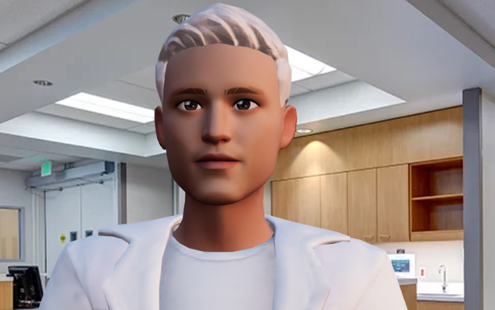
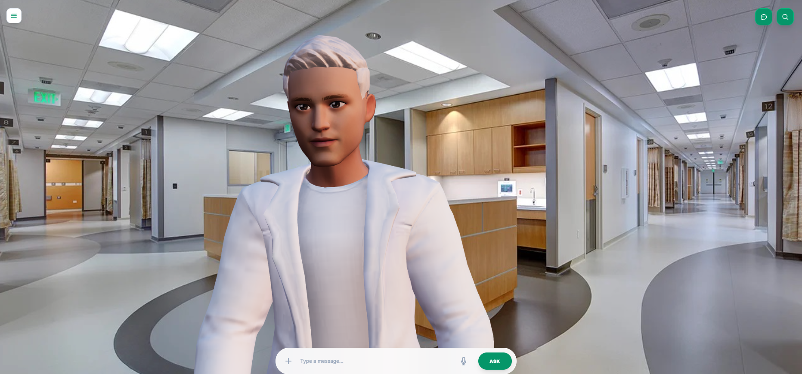
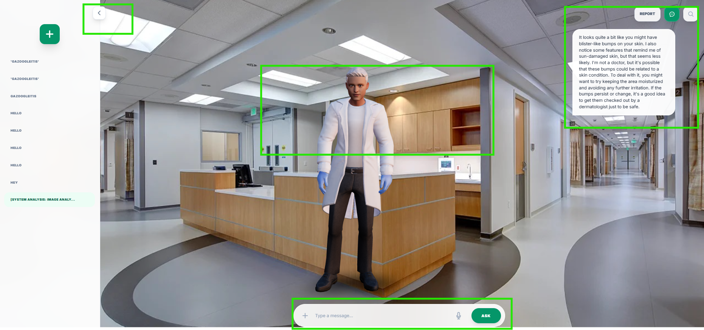
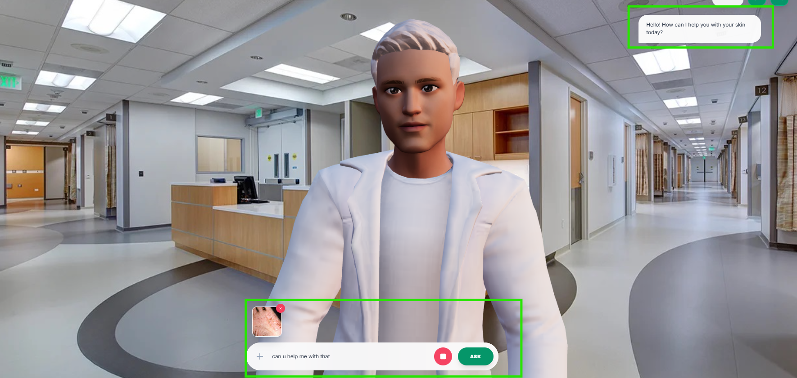
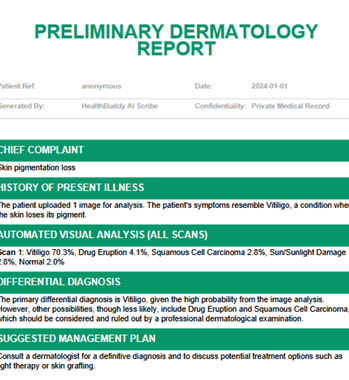
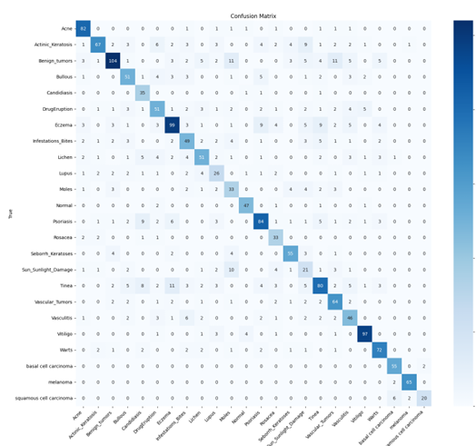

# Remedy: AI Medical Assistant

  

## Introduction
Welcome to Remedy, your intelligent healthcare companion. Leveraging cutting-edge AI, Remedy provides personalized skin health analysis through natural conversations, making dermatological insights accessible to everyone.

## Key Features

- **Visual Analysis**: Avatar Interaction

- **Voice Interaction**: Natural conversation capabilities

- **Medical Reporting**: Professional PDF report generation

## Technology Stack

- Computer Vision: Custom ResNet50 model
- Language Model: Llama-3.3-70b
- Speech Processing: Whisper AI
- Vector Database: ChromaDB

## Conclusion
Remedy represents the future of accessible healthcare, combining advanced AI with an intuitive interface to provide reliable skin health insights. Experience the power of AI in healthcare today with Remedy - your personal medical assistant.